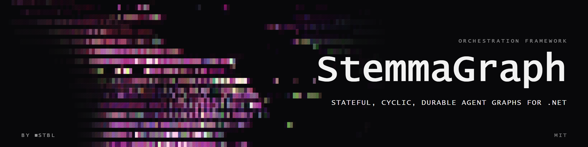

  

# StemmaGraph

> Stateful, cyclic, durable agent graphs for .NET — inspired by LangGraph,
> redesigned for the .NET runtime.

**Status: MVP runtime on `main` (Pregel + InMemory + Testing + samples).** Design:
OpenSpec [`openspec/changes/architecture-runtime-core/`](openspec/changes/architecture-runtime-core/).
See [CLAUDE.md](CLAUDE.md) and [.agents/roadmap.md](.agents/roadmap.md).

---

## What is StemmaGraph?

StemmaGraph is a low-level orchestration framework for building long-running,
stateful agents in .NET. You define a graph of nodes (functions, LLM calls,
tools) connected by edges (including **conditional** and **cyclic** edges),
and StemmaGraph runs it with:

- **Cyclic execution** — agents that loop until a condition is met (the
  killer feature missing from most .NET agent frameworks)
- **Durable checkpointing** — C-shape snapshots; InMemory in core; EF/S3/File as packages later
- **Typed state + channels/reducers** — LastValue / Append; source-gen + fluent DX
- **Pregel supersteps** — all ready nodes, barrier, multi-writer merge
- **Streaming** — `IAsyncEnumerable` for values / updates / events
- **Human-in-the-loop** — `NodeResult` interrupt + `ResumeAsync` / `Command`
- **`Microsoft.Extensions.AI`** *(post-0.1 package)* — `IChatClient`, not in core
- **UI console** *(post-0.1, #13)* — run inspector, HITL queue, topology (MD3)

Not a 1:1 LangGraph port — .NET-native API.

## What it is **not**

- **Not a LangGraph port.** Same conceptual source (cycles + state +
  checkpointing), but .NET-native API: generic state, typed reducers,
  `IAsyncEnumerable`, no `TypedDict` reflection.
- **Not a replacement for Microsoft Agent Framework.** MAF handles
  multi-agent orchestration and function-calling; StemmaGraph handles
  graphs with cycles and durable state. They compose.
- **Not an LLM framework.** StemmaGraph doesn't ship an LLM SDK; it consumes
  `IChatClient` from `Microsoft.Extensions.AI`.

## Packages

| Package | Role |
|---------|------|
| `StemmaGraph.Abstractions` | contracts (channels, checkpoint, NodeResult, …) |
| `StemmaGraph` | runtime + InMemory checkpointer (no DI package ref) |
| `StemmaGraph.DependencyInjection` | `AddStemmaGraph` for `IServiceCollection` |
| `StemmaGraph.Testing` | test doubles + conformance *(0.1)* |
| `StemmaGraph.Checkpoints.*` | EF / S3 / File *(later)* |
| `StemmaGraph.MicrosoftAi` / `StemmaGraph.UI.*` | *(later)* |

Shipped on main: Abstractions, runtime, Testing, Generators, samples.
NuGet icons (`Directory.Build.props`): **i1** core · **i4** checkpoint providers · **i5** rest.

## Roadmap

- [x] **Architecture** — OpenSpec `architecture-runtime-core`
- [x] **MVP runtime** — Pregel + InMemory + Testing + samples ([epic #1](https://github.com/dot-stbl/stemma.graph/issues/1))
- [ ] **0.1 NuGet tag** — PublicAPI review + publish
- [ ] Later — providers, Send/subgraphs, MicrosoftAi, UI, v1.0

Details: [.agents/roadmap.md](.agents/roadmap.md).

## Inspiration

StemmaGraph's design borrows heavily from the open-source
[LangGraph](https://github.com/langchain-ai/langgraph) (Python, MIT) — in
particular its Pregel-style superstep execution, channel/reducer state model,
and checkpoint-first persistence model. The API diverges substantially:
.NET-native generics, typed reducers, `IAsyncEnumerable` streaming, no
`TypedDict` reflection. We are not a port; we are a peer.

## Documentation

- [CLAUDE.md](CLAUDE.md) — architecture discussion, conventions, workflow
- [AGENTS.md](AGENTS.md) — pointer to CLAUDE.md for AI agents
- [CONTRIBUTING.md](CONTRIBUTING.md) — how to set up, build, test, commit
- [docs site](https://stemma.dev) — *coming soon* (custom domain pending)

## Contributing

See [CONTRIBUTING.md](CONTRIBUTING.md). PRs welcome — file an issue first if
the change is non-trivial.

## License

[MIT](LICENSE).

---

Built on .NET 10, xUnit + Shouldly + NSubstitute.